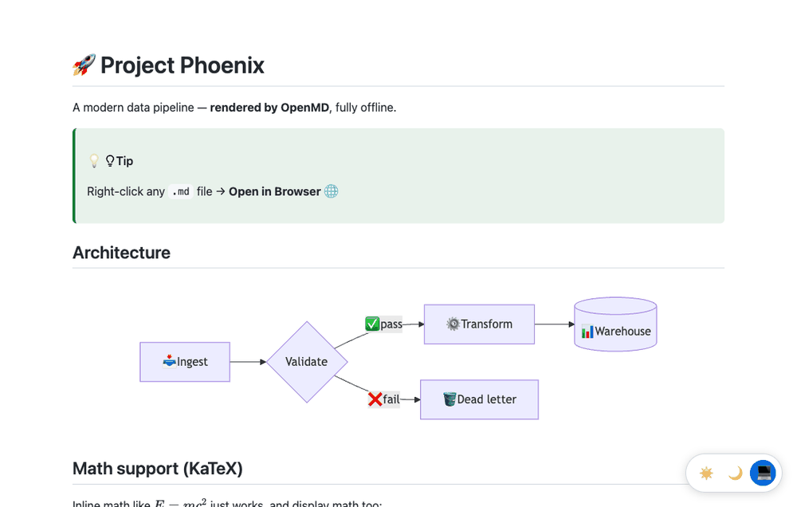

# 🚀 OpenMD

Quickly open Markdown files in your browser or VS Code preview panel with a right-click!



## ✨ Features

- 🌐 **Open in Browser** - Open Markdown in your default browser instantly
- 👁️ **Open in Preview** - View in VS Code side panel (side-by-side editing)
- 🎨 **Syntax Highlighting** - Beautiful code highlighting for all languages
- 🧜‍♀️ **Mermaid Diagrams** - Render flowcharts, sequence diagrams, and more
- ✅ **Task Lists** - Interactive checkboxes with GitHub-style `- [x]` syntax
- ⚠️ **GitHub Alerts** - Support for `[!NOTE]`, `[!TIP]`, `[!WARNING]`, `[!CAUTION]`, `[!IMPORTANT]`
- 😄 **Emoji Shortcodes** - Convert `:wave:` → 👋, `:rocket:` → 🚀, `:fire:` → 🔥
- 🧮 **Math (KaTeX)** - Render `$inline$` and `$$display$$` TeX math, fully offline
- 📝 **Footnotes** - GitHub-style `[^1]` footnotes with backlinks
- 🌓 **Dark Mode Toggle** - Switch between Light ☀️, Dark 🌙, and Auto 💻 themes
- 🎨 **Theme Toggle in Preview** - Choose between VS Code theme 🎨, Light ☀️, or Dark 🌙
- 📋 **Copy Code Button** - One-click copy for all code blocks
- 🔗 **Anchor Links** - Clickable heading links for easy navigation
- 🔄 **Auto-refresh** - Save the file and the preview reloads automatically (scroll position preserved)
- 🔌 **Works Offline** - Mermaid, syntax highlighting, and KaTeX are bundled, no CDN needed
- ⚡ **Lightning Fast** - Tiny bundled package (~3 MB), click and it's open

## 📦 Installation

### From VS Code Marketplace

1. Open VS Code
2. Go to **Extensions** (`Ctrl+Shift+X` / `Cmd+Shift+X`)
3. Search for **"OpenMD"**
4. Click **Install**

### From Open VSX Registry

1. Open VS Code
2. Go to **Extensions** (`Ctrl+Shift+X` / `Cmd+Shift+X`)
3. Click `...` → **Install from VSIX**
4. Download from [Open VSX](https://open-vsx.org/extension/auttapong-tura/openmd)

### From VSIX File

1. Download the latest `openmd-x.y.z.vsix` file from [Releases](https://github.com/AuttapOnG/OpenMD/releases)
2. Open VS Code
3. Go to **Extensions** (`Ctrl+Shift+X` / `Cmd+Shift+X`)
4. Click `...` → **Install from VSIX**
5. Select the downloaded `.vsix` file

## 🚀 Usage

### Method 1: Right-click on File
1. In the Explorer, right-click any `.md` file
2. Choose:
   - **Open in Browser** 🌐 - Opens in your default browser
   - **Open in Preview** 👁️ - Opens in VS Code panel

### Method 2: Right-click in Editor
1. Open a Markdown file in the editor
2. Right-click on the content
3. Select the same menu options as Method 1

## 📝 Example Markdown

```markdown
## Mermaid Diagram
\`\`\`mermaid
flowchart TD
    A[Start] --> B{Decision}
    B -->|Yes| C[Success]
    B -->|No| D[Retry]
\`\`\`

## GitHub Alerts
> [!NOTE]
> This is a note!

> [!TIP]
> Here's a helpful tip 💡

## Task List
- [x] Install OpenMD
- [ ] Write documentation
- [ ] Share with friends :rocket:

## Emoji
Hello :wave: Welcome! :fire: :sparkles:
```

## 📝 License

MIT © [Auttapong Tura](https://github.com/AuttapOnG)

## 🤝 Contributing

Want to contribute? See our [Development Guide](DEVELOPMENT.md) for setup instructions.

---

**Enjoy!** If you like this extension, please consider [starring ⭐ the repo](https://github.com/AuttapOnG/OpenMD)!
