# 🎯 OpenMD Test - All Features

## 1. Syntax Highlighting

```javascript
function greet(name) {
    console.log(`Hello, ${name}!`);
    return true;
}
```

```python
def fibonacci(n):
    if n <= 1:
        return n
    return fibonacci(n-1) + fibonacci(n-2)
```

## 2. Mermaid Diagram

```mermaid
flowchart TD
    A[Start] --> B{Is it working?}
    B -->|Yes| C[Great! 🎉]
    B -->|No| D[Debug]
    D --> B
    C --> E[Deploy]
```



## 3. Task Lists

- [x] Setup project
- [x] Install dependencies  
- [x] Write code
- [ ] Test everything
- [ ] Deploy

## 4. GitHub Alerts

> [!NOTE]
> This is a note for your information.

> [!TIP]
> Here's a helpful tip!

> [!IMPORTANT]
> This is something important you should know.

> [!WARNING]
> Be careful with this!

> [!CAUTION]
> This could break things!

## 5. Emoji Shortcodes

Hello :wave: Welcome to OpenMD! :rocket:

This is :fire: and :sparkles: amazing!

## 6. Table

| Feature | Status | Priority |
|---------|--------|----------|
| Syntax Highlight | ✅ Done | High |
| Mermaid | ✅ Done | High |
| Task Lists | ✅ Done | Medium |

## 7. Inline Code

Use `npm run compile` to build the project.

## 8. Blockquote

> "The best way to predict the future is to invent it."
> — Alan Kay

## 9. Anchor Links Test {#custom-anchor}

This heading has a custom anchor!

